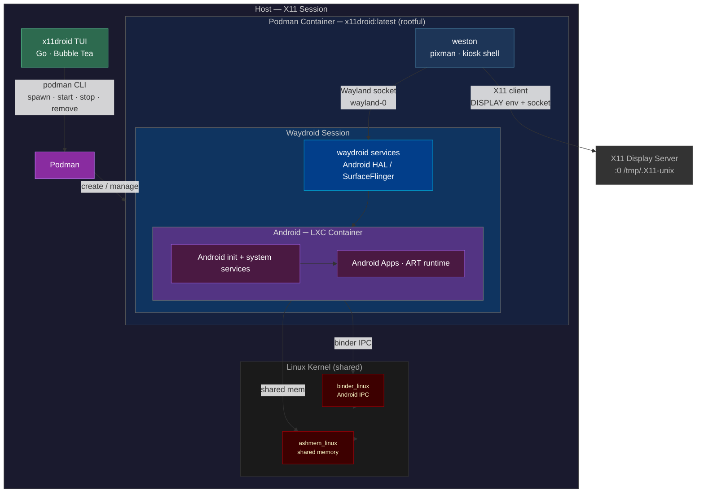

# x11droid


A CLI/TUI for running and managing [Waydroid](https://waydro.id) instances inside Podman containers on X11.

> Inspired by [use-waydroid-on-x11](https://github.com/1999AZZAR/use-waydroid-on-x11) by 1999AZZAR.

Each instance is an isolated Podman container running a nested **weston** compositor that forwards its display to your X11 session. Android runs as a real LXC container on your host kernel via `binder` — no emulation, no VM.

> **Runs as root.** waydroid needs rootful podman to loop-mount the Android system image (rootless can't, even `--privileged`). Run the app with `sudo x11droid`; it figures out your display and home automatically.

<!-- Add a screenshot here: docs/screenshot.png (TUI dashboard + an Android window) -->

## Features

- **Multiple isolated instances**, each its own Android device + data
- **TUI + scriptable CLI** for the full lifecycle (spawn / start / stop / remove / purge / shell / logs / attach)
- **Fullscreen Android** via weston kiosk-shell (no panel), titled `x11droid - <name> - weston - Android <ver>`
- **GApps** (Google Play) and **ARM translation** (libndk) toggles
- **Apps bundle** — optionally install F-Droid, Aurora, Obtainium, Shelter on first boot
- **Custom device name** (sets `ro.product.model`)
- **Config screen** — resolution, orientation, compositor (persisted)
- **Purge** to wipe an instance's data; **live logs**; `just logcat <name>` for Android logcat

## Documentation

- **[Advanced usage](docs/ADVANCED.md)** — full CLI reference, internals, apps/ARM, device spoofing, persistence
- **[Troubleshooting](docs/TROUBLESHOOTING.md)** — symptom → cause → fix for the common issues

## How it works



**Control plane:** x11droid manages container lifecycle via the rootful `podman` CLI.

**Display path:** weston (pixman renderer, kiosk shell — fullscreen, no panel) runs as an X11 client inside the container over the mounted `/tmp/.X11-unix` socket; Android renders into its window. cage is tried first but falls back to weston, since its wlroots X11 backend can't allocate buffers on NVIDIA.

**Kernel path:** Android IPC (`binder`) runs directly on your host kernel — no emulation, no VM. The container provisions its binder devices via **binderfs**, so no special `CONFIG_ANDROID_BINDER_DEVICES` is required.

## Prerequisites

- Linux with `binder_linux` and binderfs available (`grep binder /proc/filesystems`)
- [Podman](https://podman.io) — used **rootful** (the app runs under `sudo`)
- `sudo` access
- A local **X11** display (`echo $XDG_SESSION_TYPE` → `x11`). Wayland-only sessions won't work; weston forwards over the X11 socket.
- [just](https://just.systems) + [asdf](https://asdf-vm.com) with the `golang` plugin (to build from source)

## Quick start

x11droid must run as **root** (`sudo`): waydroid needs rootful podman to loop-mount
the Android system image — rootless podman cannot, even `--privileged`.

```bash
# 1. build + install the binary to /usr/local/bin
just build && just install

# 2. run as root
sudo x11droid
```

In the app: press `s` (Setup) → **Build Image** (first time, ~500MB), then **Load Modules**,
then `n` to create an instance. The Setup screen shows module/image status. Running under
`sudo`, the app targets your X11 display (`:0`) and home directory automatically; no manual
`sudo podman` or credential caching is needed.

## TUI

```
x11droid  /  Dashboard
┌─────────────────────────────────────────────────────────┐
│ Instances (2)                                           │
│                                                         │
│ ▶ pixel9          a1b2c3d4e5f6  Up 2 hours    x11droid  │
│   pixel9-gapps    b2c3d4e5f6a1  Exited (0)   x11droid  │
│                                                         │
└─────────────────────────────────────────────────────────┘
↑↓ navigate  enter select  n new  s setup  r refresh  q quit
```

**Views:**

| View | How to open | Description |
|------|-------------|-------------|
| Dashboard | default | All instances with status (auto-refreshes) |
| Instance | `enter` | Show UI / Start / Stop / Remove / Purge / Shell / Logs |
| New Instance | `n` | Name + GApps / ARM / Persist toggles |
| Config | `c` | Resolution, orientation, compositor (saved) |
| Setup | `s` | Module status, image build, sudo modules |

**Key bindings:**

| Key | Action |
|-----|--------|
| `↑` / `↓` or `j` / `k` | Navigate |
| `←` / `→` or `space` | Change value (config / toggles) |
| `enter` | Select / confirm |
| `esc` | Back |
| `n` | New instance |
| `c` | Config screen |
| `s` | Setup screen |
| `r` | Refresh |
| `tab` | Next field (spawn form) |
| `q` / `ctrl+c` | Quit |

Instance actions include **Show UI** ((re)open the Android window), **Purge** (remove + delete the instance's Android data), and the usual Start/Stop/Remove/Shell/Logs (logs are live).

## Just recipes

```
just build          build the binary
just run            build and run the TUI
just install        install to /usr/local/bin (sudo; needed for `sudo x11droid`)
just image-build    podman build -t x11droid:latest
just image-clean    remove the container image
just check          vet + test + lint
just tidy           go mod tidy
just vet            go vet ./...
just clean          remove built binary
```

Kernel modules are managed inside the app (Setup screen) or via `x11droid setup load`,
not through `just`.

## ARM translation & GApps

Pure-Java apps run without any translation layer. Apps (and **GApps** Google services) with ARM-native libraries need a translation layer or they crash/boot-loop on x86_64.

Enable the **ARM** toggle in the New Instance form — on first boot it installs `libndk` via [waydroid_script](https://github.com/casualsnek/waydroid_script) automatically (adds a few minutes). For GApps, enable both **GApps** and **ARM**.

Note: GApps may still show "device not certified" in the Play Store — that's a one-time Google device registration (`google.com/android/uncertified`), separate from the boot issue.

## Cleanup

```bash
# stop and remove all x11droid containers (rootful)
sudo podman ps -a --filter label=x11droid=true --format '{{.Names}}' | xargs -r sudo podman rm -f -t 0

# delete an instance's Android data too — easier from the app: Instance → Purge

# unload kernel modules (or use the app: Setup → Unload Modules)
sudo x11droid setup unload

# remove the image
sudo podman rmi -f x11droid:latest
```
