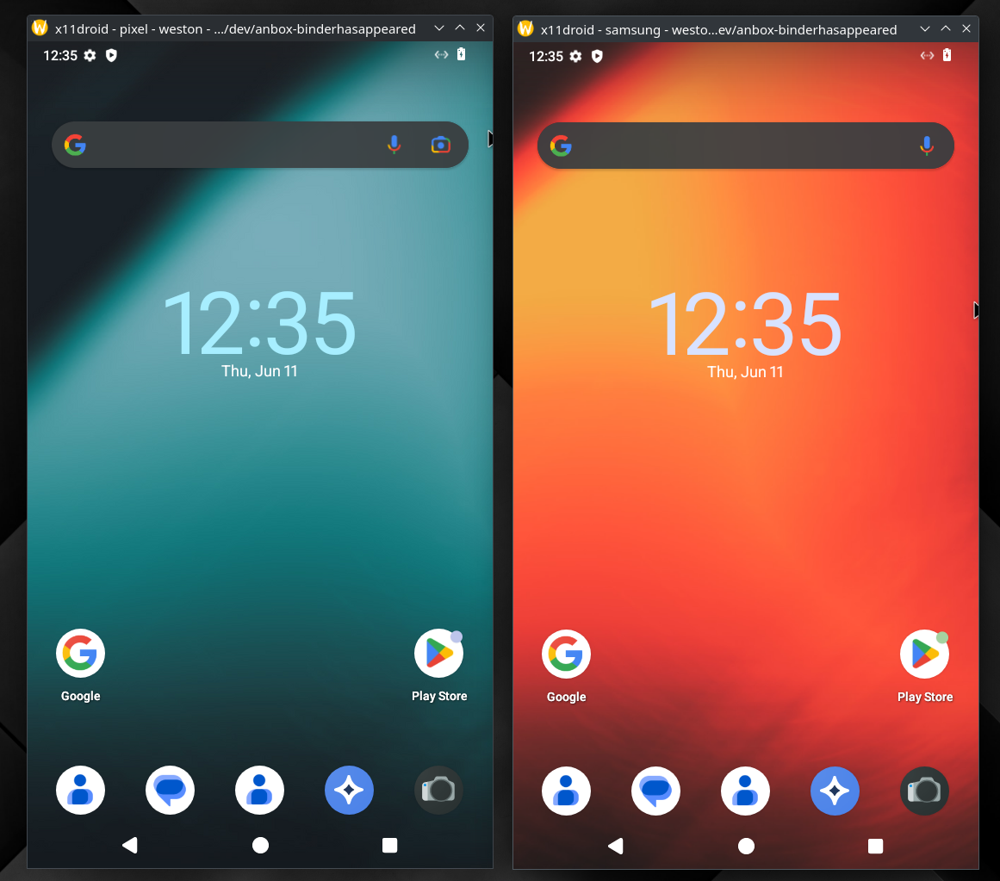
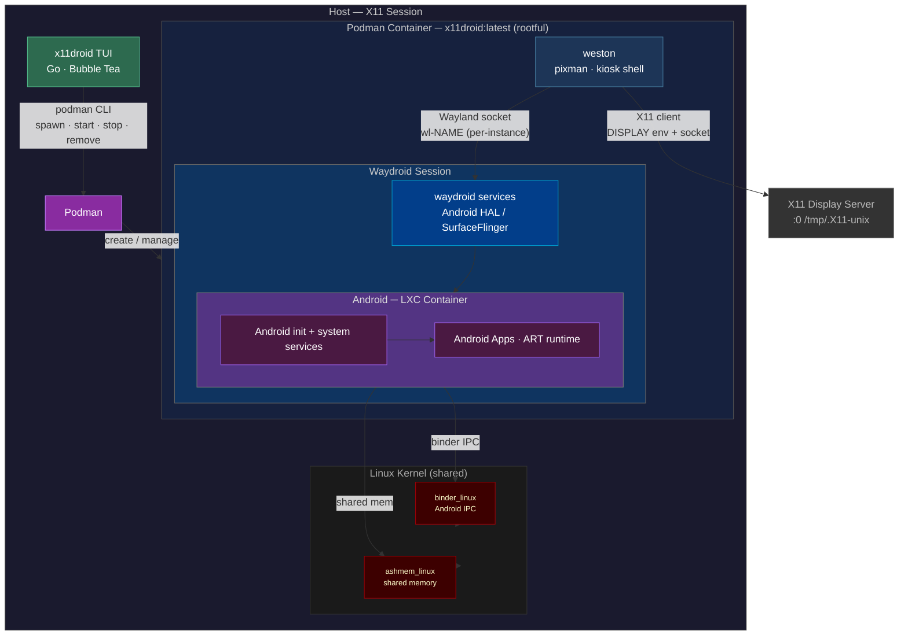
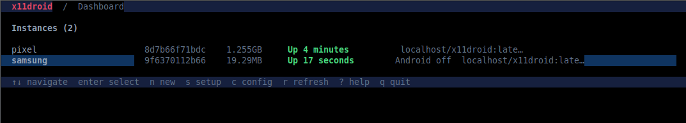
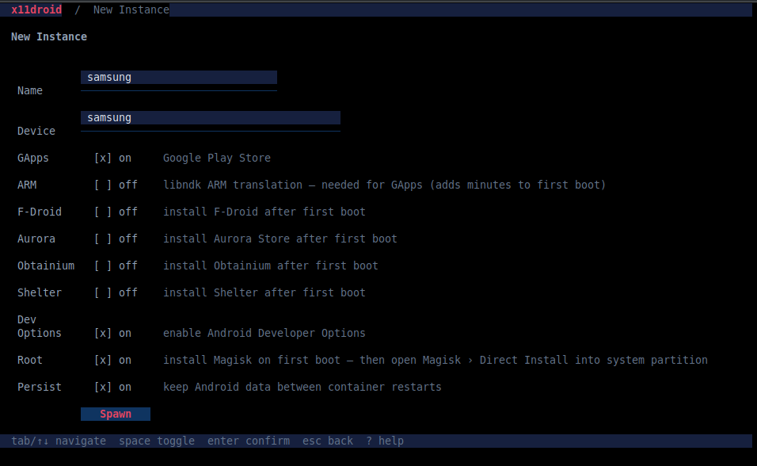

# x11droid

<table>
  <tr>
    <th>CI</th>
    <th>Code</th>
    <th>Security</th>
    <th>Stack</th>
    <th>Spec</th>
  </tr>
  <tr>
    <td>
      <a href="https://github.com/thereisnotime/x11droid/actions/workflows/ci.yml"></a><br>
      <a href="https://github.com/thereisnotime/x11droid/actions/workflows/codeql.yml"></a><br>
      <a href="https://github.com/thereisnotime/x11droid/actions/workflows/release.yml"></a>
    </td>
    <td>
      <a href="https://goreportcard.com/report/github.com/thereisnotime/x11droid"></a><br>
      <a href="https://codecov.io/gh/thereisnotime/x11droid"></a><br>
      <a href="https://pkg.go.dev/github.com/thereisnotime/x11droid"></a><br>
      <a href="go.mod"></a><br>
      <a href="https://github.com/thereisnotime/x11droid/releases/latest"></a><br>
      <a href="https://github.com/thereisnotime/x11droid/commits/master"></a>
    </td>
    <td>
      <a href="https://github.com/thereisnotime/x11droid/actions/workflows/security.yml"></a><br>
      <a href="https://github.com/thereisnotime/x11droid/actions/workflows/scorecard.yml"></a><br>
      <a href="https://securityscorecards.dev/viewer/?uri=github.com/thereisnotime/x11droid"></a><br>
      <a href="https://www.bestpractices.dev/en/projects?q=x11droid"></a><br>
      <!-- After registering at https://www.bestpractices.dev/en/projects/new (GitHub login → add this repo),
           replace the line above with the live badge using your numeric PROJECT_ID:
      <a href="https://www.bestpractices.dev/projects/PROJECT_ID"></a><br>
      -->
      <a href="LICENSE"></a>
    </td>
    <td>
      <br>
      <br>
      
    </td>
    <td>
      <a href="openspec/"></a>
    </td>
  </tr>
</table>

**Don't like Wayland? Want to run Waydroid/Android in X11 as a container instead of a VM? This is what x11droid does.**

> [!IMPORTANT]
> **[🔓 Keep Android Open](https://keepandroidopen.org/)** — Google is moving to require developer registration to install Android apps. If you value sideloading and an open platform, read the campaign and take action.

> [!NOTE]
> **Under active development** — expect rough edges and breaking changes. Hit a bug? [Open an issue](https://github.com/thereisnotime/x11droid/issues/new?template=bug_report.yml) — the template collects the host/log info needed to debug.

A CLI/TUI for running and managing [Waydroid](https://waydro.id) instances inside Podman containers on X11.

> Inspired by [use-waydroid-on-x11](https://github.com/1999AZZAR/use-waydroid-on-x11) by 1999AZZAR.

Each instance is an isolated Podman container running a nested **weston** compositor that forwards its display to your X11 session. Android runs as a real LXC container on your host kernel via `binder` — no emulation, no VM.

> **Runs as root.** waydroid needs rootful podman to loop-mount the Android system image (rootless can't, even `--privileged`). Run the app with `sudo x11droid`; it figures out your display and home automatically.

<p align="center">
  
  <br><sub>Two instances (<code>pixel</code>, <code>samsung</code>) running at once — fullscreen, native x86.</sub>
</p>

## Features

- **Multiple isolated instances**, each its own Android device + data
- **TUI + scriptable CLI** for the full lifecycle (spawn / start / stop / remove / purge / shell / logs / attach)
- **Fullscreen Android** via weston kiosk-shell (no panel), titled `x11droid - <name> - weston - Android <ver>`
- **GApps** (Google Play) and **ARM translation** (libndk) toggles
- **App toggles** — optionally install any of F-Droid, Aurora, Obtainium, Shelter on first boot
- **Dev Options** and **Root** (Magisk via waydroid_script) toggles
- **Custom device name** (sets `ro.product.model`)
- **Config screen** — resolution, orientation, compositor (persisted)
- **Purge** / **`prune`** to reclaim disk (per-instance or orphan data); **live logs**; `just logcat <name>` for Android logcat

## Documentation

- **[Advanced usage](docs/ADVANCED.md)** — full CLI reference, internals, apps/ARM, device spoofing, persistence
- **[Troubleshooting](docs/TROUBLESHOOTING.md)** — symptom → cause → fix for the common issues

## How it works



**Control plane:** x11droid manages container lifecycle via the rootful `podman` CLI.

**Display path:** weston (pixman renderer, kiosk shell — fullscreen, no panel) runs as an X11 client inside the container over the mounted `/tmp/.X11-unix` socket; Android renders into its window. cage is tried first but falls back to weston, since its wlroots X11 backend can't allocate buffers on NVIDIA.

**Kernel path:** Android IPC (`binder`) runs directly on your host kernel — no emulation, no VM. The container provisions its binder devices via **binderfs**, so no special `CONFIG_ANDROID_BINDER_DEVICES` is required.

## Prerequisites

- Linux with `binder_linux` and binderfs available (`grep binder /proc/filesystems`)
- [Podman](https://podman.io) — used **rootful** (the app runs under `sudo`)
- `sudo` access
- A local **X11** display (`echo $XDG_SESSION_TYPE` → `x11`). Wayland-only sessions won't work; weston forwards over the X11 socket.
- [just](https://just.systems) + [asdf](https://asdf-vm.com) with the `golang` plugin (to build from source)

## Quick start

x11droid must run as **root** (`sudo`): waydroid needs rootful podman to loop-mount
the Android system image — rootless podman cannot, even `--privileged`.

```bash
# 1. build + install the binary to /usr/local/bin
just build && just install

# 2. run as root
sudo x11droid
```

In the app: press `s` (Setup) → **Build Image** (first time, ~500MB), then **Load Modules**,
then `n` to create an instance. The Setup screen shows module/image status. Running under
`sudo`, the app targets your X11 display (`:0`) and home directory automatically; no manual
`sudo podman` or credential caching is needed.

## TUI

<p align="center">
  
  <br><sub>Dashboard — live instance list with per-instance RAM and status (<code>samsung</code> shows <code>Android off</code>: container up, session not running).</sub>
</p>

<p align="center">
  
  <br><sub>New Instance — GApps, ARM translation, app toggles, Dev Options, Root (Magisk), and persistence.</sub>
</p>

```
x11droid  /  Dashboard
┌─────────────────────────────────────────────────────────┐
│ Instances (2)                                           │
│                                                         │
│ ▶ pixel9        a1b2c3d4e5f6  812MB  Up 2 hours  x11droid│
│   pixel9-gapps  b2c3d4e5f6a1  -      Exited (0)  x11droid│
│                                                         │
└─────────────────────────────────────────────────────────┘
↑↓ navigate  enter select  n new  s setup  r refresh  q quit
```

**Views:**

| View | How to open | Description |
|------|-------------|-------------|
| Dashboard | default | All instances with status (auto-refreshes) |
| Instance | `enter` | Show UI / Hide UI / Start / Stop / Remove / Purge / Shell / Android Shell / Logs / Logcat |
| New Instance | `n` | Name + GApps / ARM / F-Droid / Aurora / Obtainium / Shelter / Dev Options / Root / Persist toggles |
| Config | `c` | Resolution, orientation, compositor (saved) |
| Setup | `s` | Module status, image build, sudo modules |

**Key bindings:**

| Key | Action |
|-----|--------|
| `↑` / `↓` or `j` / `k` | Navigate |
| `←` / `→` or `space` | Change value (config / toggles) |
| `enter` | Select / confirm |
| `esc` | Back |
| `n` | New instance |
| `c` | Config screen |
| `s` | Setup screen |
| `r` | Refresh |
| `tab` | Next field (spawn form) |
| `q` / `ctrl+c` | Quit |

Instance actions include **Show UI** ((re)open the Android window — it relaunches the compositor if it died, so a black/closed window recovers without a respawn), **Hide UI** (unmaps the X11 window — Android and the compositor keep running, so Show UI re-maps it instantly with no reboot), **Purge** (remove + delete the instance's Android data), and the usual Start/Stop/Remove/Shell/Logs (logs are live).

## CLI

The bare command opens the TUI; every action is also a scriptable subcommand (all run under `sudo`):

```bash
sudo x11droid spawn pixel --gapps --hidearm --root --dev-options   # create + start
sudo x11droid list                  # all instances + status
sudo x11droid attach pixel          # (re)open the GUI window
sudo x11droid hide pixel            # hide the window (Android keeps running)
sudo x11droid stop pixel            # start · stop · rm [--purge]
sudo x11droid adb pixel             # Android root shell (pm / settings / su / magisk)
sudo x11droid install pixel app.apk # install a local .apk into Android
sudo x11droid logcat pixel          # stream Android logcat (-d to dump once)
sudo x11droid shell pixel           # bash inside the container
sudo x11droid logs pixel            # container + entrypoint logs
sudo x11droid prune --all           # reclaim orphan data
sudo x11droid setup build           # build the image (also: load / unload / status)
sudo x11droid config --width 720 --height 1280
```

| Command | Description |
|---------|-------------|
| `list` (`ls`, `ps`) | List instances with status |
| `spawn <name> [flags]` | Create and start an instance (`--gapps --hidearm --root --dev-options --fdroid --aurora --obtainium --shelter --device-name --no-pv`) |
| `attach [name]` / `hide <name>` | (Re)open / hide the GUI window |
| `start` / `stop` / `rm [--purge]` | Lifecycle (`rm --purge` also deletes the instance's data) |
| `adb <name>` (`android-shell`) | Interactive Android root shell (`pm` / `settings` / `su` / `magisk`) |
| `install <name> <apk>` (`apk`) | Install a local `.apk` into Android |
| `logcat <name> [-d]` | Stream Android logcat (`-d` dumps once) |
| `shell` / `logs` | Container bash / view the container logs |
| `prune [--all]` | Show disk usage and reclaim orphan data |
| `config` / `setup` / `version` | Defaults / image+modules / version |

Full reference (flags, internals, debug helpers): **[docs/ADVANCED.md](docs/ADVANCED.md)**.

## Just recipes

```
just build          build the binary
just run            build and run the TUI
just install        install to /usr/local/bin (sudo; needed for `sudo x11droid`)
just image-build    podman build -t x11droid:latest
just image-clean    remove the container image
just check          vet + test + lint
just tidy           go mod tidy
just vet            go vet ./...
just clean          remove built binary
```

Kernel modules are managed inside the app (Setup screen) or via `x11droid setup load`,
not through `just`.

## ARM translation & GApps

Pure-Java apps run without any translation layer. Apps (and **GApps** Google services) with ARM-native libraries need a translation layer or they crash/boot-loop on x86_64.

Enable the **ARM** toggle in the New Instance form — on first boot it installs `libndk` via [waydroid_script](https://github.com/casualsnek/waydroid_script) automatically (adds a few minutes). For GApps, enable both **GApps** and **ARM**.

Note: GApps may still show "device not certified" in the Play Store — that's a one-time Google device registration (`google.com/android/uncertified`), separate from the boot issue.

## Cleanup

```bash
# stop and remove all x11droid containers (rootful)
sudo podman ps -a --filter label=x11droid=true --format '{{.Names}}' | xargs -r sudo podman rm -f -t 0

# delete an instance's Android data too — easier from the app: Instance → Purge

# unload kernel modules (or use the app: Setup → Unload Modules)
sudo x11droid setup unload

# remove the image
sudo podman rmi -f x11droid:latest
```

## Roadmap

- [ ] **Cache the base images** — download the LineageOS system/vendor images once and share them read-only across instances (overlays + `/data` stay per-instance), instead of a full ~3 GB copy per instance.
- [ ] **More Android flavors** — pick the system image at spawn time (today: vanilla / GApps); offer other LineageOS variants and Android versions as waydroid publishes them.
- [ ] **adb over TCP** — optional `adb connect` to an instance for the full `adb` toolchain (push/pull, `adb logcat -f`, Android Studio).
- [ ] **Device spoofing presets** — one-click `Build.*` profiles (e.g. a real Pixel) for app compatibility.
- [ ] **Fix config-folder ownership** — running under `sudo` leaves `~/.config/x11droid/` (instances, images, data) owned by `root`, so the invoking user can't manage or delete them without `sudo`. `chown` the tree back to `SUDO_USER` so it stays user-owned.
- [ ] **Auto-grant permissions for installed apps** — after installing the optional apps (F-Droid, Aurora, Obtainium, Shelter, Magisk), grant the runtime permissions and special access they need (install-unknown-apps, storage, etc.) via `pm grant` / `appops` / `cmd` so they work out of the box without manual tapping through dialogs.
- [x] **Release pipeline** — goreleaser builds Linux amd64/arm64 binaries (+ checksums, syft SBOM, cosign signature, SLSA provenance); release-please drives SemVer + CHANGELOG from conventional commits.
- [x] **CI/CD** — CI (build · test · lint · CodeQL · Scorecard · security suite · coverage) plus CD (release-please → goreleaser with signing/provenance). Optional container-image publishing intentionally skipped (the image is built locally, not distributed).
- [ ] **Refactor for testability** — extract the parsing/decision logic out of the podman/waydroid exec wrappers (`container`, `tui`) into pure functions so more of the codebase is unit-testable, raising real coverage beyond the I/O glue.
- [ ] **Dynamic OpenSpec badges** — re-add the gh-pages badge workflow (spec/requirement/task/change counts) once the first specs/changes are authored; the badge action errors on an empty OpenSpec project.
- [x] Screenshot/GIF in the README.

## Contributing

Issues and PRs welcome — see **[CONTRIBUTING.md](CONTRIBUTING.md)**. `just check` (vet + test + lint) must pass; CI runs the same. Found a bug? Use the [bug report form](https://github.com/thereisnotime/x11droid/issues/new?template=bug_report.yml) — it collects the host/log info needed to debug.

<a href="https://github.com/thereisnotime/x11droid/graphs/contributors"></a>

## License

[GPL-3.0](LICENSE) © x11droid contributors.
